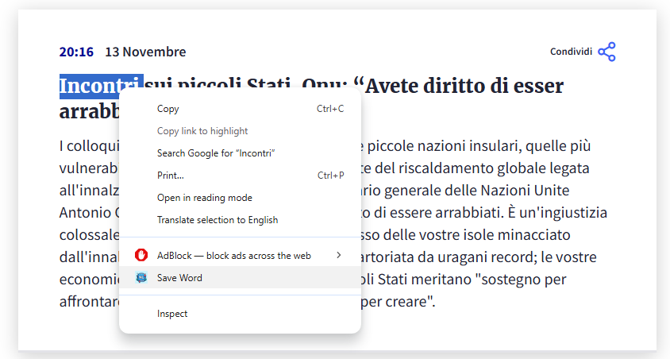
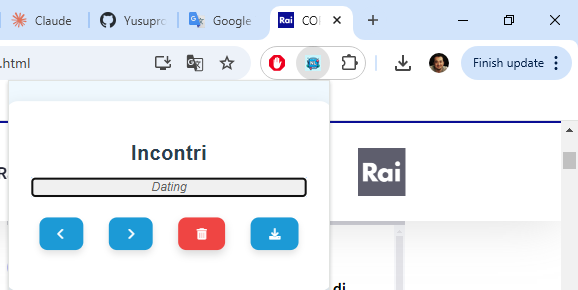
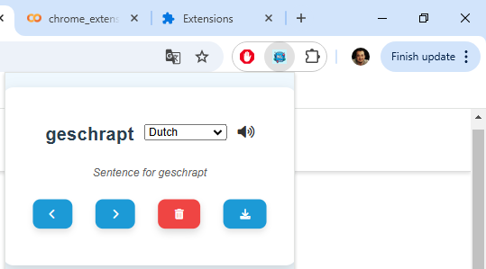
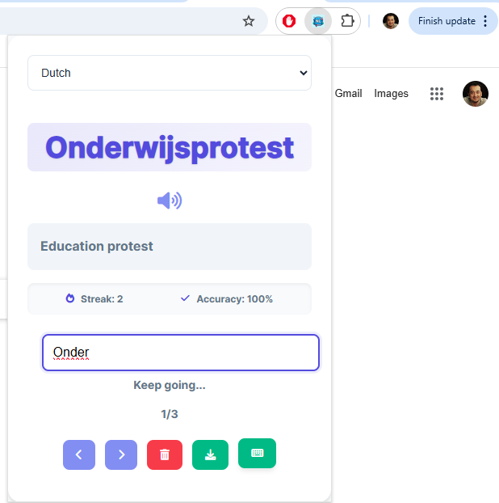

# Daily Word Extension

## Screenshots

### 1. Save Selected Word
In the first screenshot, you can see the functionality that allows you to save a word by clicking the "Save" button. This feature helps store your selected words for later study.

### 2. Edit Word or Sentence or Translation
In the second screenshot, you can see the option to edit either the word, sentence, or its translation. This allows you to customize the content and make it more relevant to your learning.

### 3. Pronunciation Feature
In the third screenshot, you can see the new pronunciation feature. By clicking the "Pronounce" button, you can listen to the pronunciation of the word to help improve your speaking and listening skills.

### 4. Typing Practice (New updates)
In the fourth screenshot, you can see the typing practice feature. This interactive tool helps you reinforce your learning by typing the words you're studying. The interface provides immediate feedback on your accuracy and helps build muscle memory for new vocabulary.

## How to Use:
1. **Install the Extension**: Download and install the extension in your browser.
2. **View Daily Word**: Upon activation, the extension will show you a new word along with an example sentence.
3. **Save, Edit, or Download**: Use the buttons to save the word, edit it, or download it for offline use.
4. **Pronounce the Word**: Click the "Pronounce" button to hear the correct pronunciation of the word.
5. **Practice Typing**: Use the typing feature to practice spelling the words correctly. You'll receive immediate feedback on your input.
6. **Receive Daily Reminders**: You will receive two notifications a day to remind you to review new words.

## Installation Instructions:
1. Download or clone this repository.
2. Navigate to your browser's Extensions page.
3. Enable "Developer Mode" and click "Load Unpacked".
4. Select the directory where the extension files are located.